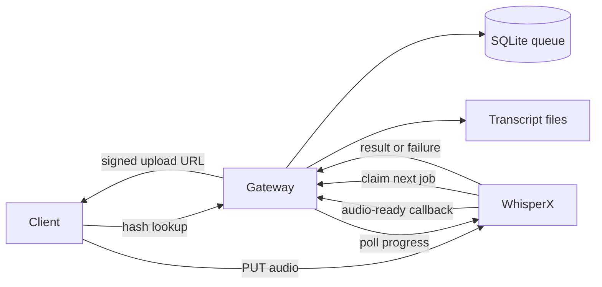

# Transcription gateway

Rust coordinator for content-addressed audio transcription. SQLite stores the
job queue and lookup metadata. Local disk stores transcript JSON. Clients
upload audio directly to a separate WhisperX server.

## Architecture

The gateway is the only job coordinator. WhisperX accepts audio, stores it by
SHA-256, and pulls work when its inference worker is idle.



Audio bytes never pass through the gateway. WhisperX and the gateway share an
upload secret. The secret lets the gateway issue time-limited upload tokens
without giving clients either service API key.

## Job flow

1. The client calculates the lowercase SHA-256 of the original audio bytes.
2. The client sends the hash to `POST /v1/audio/lookup`.
3. A ready cache hit returns the transcript.
4. An active cache hit returns the existing job status.
5. A cache miss creates an `awaiting_upload` job and returns a signed WhisperX
   upload URL.
6. The client sends raw audio bytes to that URL with `PUT`.
7. WhisperX verifies the token and hash, then calls the gateway
   `audio-ready` route.
8. The gateway changes the job to `pending`.
9. An idle WhisperX worker claims the oldest pending job.
10. WhisperX posts the transcript or a failure to the gateway.
11. The client polls the job route or uses the SSE status stream.

The status sequence is:

```text
awaiting_upload -> pending -> processing -> ready
                                      \-> failed
failed -> awaiting_upload
processing -> pending (gateway restart recovery)
```

An upload token expires after two hours. The gateway changes an abandoned
`awaiting_upload` job to `failed`. A later hash lookup creates a new upload
token for the same job.

## Requirements

- Rust 1.97 or later
- Persistent storage for `DATA_DIR`
- Network access from the gateway to WhisperX
- Matching `GATEWAY_WORKER_KEY` and `WHISPERX_UPLOAD_SECRET` values on both
  services

## Configure

Copy the example:

```bash
cp .env.example .env
```

Set:

- `GATEWAY_API_KEY`: Authenticates client lookup and job requests.
- `GATEWAY_WORKER_KEY`: Authenticates WhisperX claims and callbacks.
- `WHISPERX_BASE_URL`: Internal WhisperX URL used for progress polling.
- `WHISPERX_PUBLIC_BASE_URL`: WhisperX URL that clients use for upload.
- `WHISPERX_API_KEY`: Authenticates gateway progress requests.
- `WHISPERX_UPLOAD_SECRET`: Signs upload tokens. Use the same value on
  WhisperX.
- `DATA_DIR`: Contains `lookup.db`, `tmp/`, and `transcripts/`.
- `DATABASE_URL`: Optional SQLite URL. The default uses `DATA_DIR/lookup.db`.

Use different values for `GATEWAY_API_KEY` and `GATEWAY_WORKER_KEY`.

## Run

```bash
cargo run --release
```

The gateway listens on `0.0.0.0:8080` by default.

## Local VM on OrbStack

On an Apple Silicon Mac, create an Ubuntu VM:

```bash
orb create ubuntu:24.04 transcription-gateway
orb shell transcription-gateway
```

OrbStack mounts Mac paths at the same path inside the VM. Run setup from the
checkout:

```bash
cd /Users/valkary/Documents/transcription-gateway
./setup.sh
```

The setup script:

1. Installs Rust and the required system packages.
2. Builds the release binary.
3. Writes `.env` with generated keys if the file does not exist.
4. Copies `WHISPERX_API_KEY` from the WhisperX checkout.
5. Writes shared worker secrets into the WhisperX `.env`.
6. Installs and starts the `transcription-gateway.service` systemd unit.

Create the WhisperX VM first so the gateway can read its API key. On OrbStack,
the gateway hostname is `transcription-gateway.orb.local`. OrbStack also
forwards the service to `http://localhost:8080`.

```bash
set -a
source .env
set +a

curl -s "http://transcription-gateway.orb.local:8080/health"
```

Restart after you edit `.env`:

```bash
sudo systemctl restart transcription-gateway.service
sudo journalctl -u transcription-gateway.service -f
```

## Client API

All `/v1` client routes require:

```text
Authorization: Bearer {GATEWAY_API_KEY}
```

### `POST /v1/audio/lookup`

Request:

```json
{
  "sha256": "64 lowercase hexadecimal characters",
  "model": "whisper-1",
  "language": "en"
}
```

`model` and `language` are optional. An omitted language enables automatic
detection.

Responses:

- `200`: Stored transcript.
- `202`: The job needs an upload, is queued, or is processing.
- `500`: The job failed.

An `awaiting_upload` response includes:

```json
{
  "job_id": "uuid",
  "status": "awaiting_upload",
  "stage": "awaiting_upload",
  "progress_percent": 0,
  "message": "Waiting for audio",
  "upload_url": "https://whisperx.example/v1/jobs/uuid/audio?sha256=...",
  "upload_token": "expires.hmac",
  "upload_expires_at": 1787030400
}
```

Upload raw audio bytes directly to WhisperX:

```bash
curl -X PUT "$UPLOAD_URL" \
  -H "Authorization: Bearer $UPLOAD_TOKEN" \
  -H "Content-Type: audio/mp4" \
  --data-binary @note.m4a
```

### `GET /v1/jobs/{job_id}`

Returns `202` while the job is active, `200` with the transcript when ready,
or `500` after failure.

### `GET /v1/jobs/{job_id}/events`

Streams SSE `status` events until the job is `ready` or `failed`. The stream
does not include the transcript. Call the job route after a `ready` event.

## WhisperX worker API

All internal routes require:

```text
Authorization: Bearer {GATEWAY_WORKER_KEY}
```

Clients must not use the internal routes.

### `POST /v1/internal/jobs/{job_id}/audio-ready`

Request:

```json
{"sha256": "64 lowercase hexadecimal characters"}
```

Changes a matching `awaiting_upload` job to `pending`. A repeated callback for
a pending, processing, or ready job returns `204`.

### `POST /v1/internal/worker/claim`

Atomically claims the oldest pending job and changes it to `processing`.
Returns `204` when the queue is empty.

```json
{
  "job_id": "uuid",
  "content_sha256": "64 lowercase hexadecimal characters",
  "model": "whisper-1",
  "requested_language": ""
}
```

### `POST /v1/internal/jobs/{job_id}/result`

Accepts a WhisperX `verbose_json` transcript. The gateway writes the
transcript atomically and changes the job to `ready`.

### `POST /v1/internal/jobs/{job_id}/fail`

Request:

```json
{
  "error": "error text",
  "reason": "audio_missing"
}
```

`audio_missing` returns a processing job to `awaiting_upload`.
`transcription_failed` changes the job to `failed`.

## Progress

While a row is `processing`, the gateway polls WhisperX `GET /v1/progress`
every 500 milliseconds. The gateway accepts a snapshot only when its `job_id`
matches the processing row.

## Operations

Back up `DATA_DIR` as one unit. SQLite uses WAL mode. The gateway stores no
audio files.

One WhisperX worker still processes one file at a time. A high ingest rate can
grow the queue and consume WhisperX disk. Plan WhisperX disk capacity from the
pending job count and average audio size.
